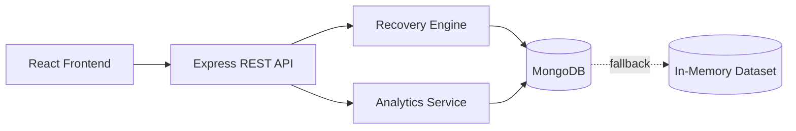

<div align="center">

# RazorRecover AI

### Intelligent Payment Revenue Recovery Platform

An explainable AI-powered platform that analyzes failed payments, predicts recovery probability, estimates recoverable revenue, and recommends the next best recovery action.

[](https://reactjs.org/)
[](https://nodejs.org/)
[](https://expressjs.com/)
[](https://www.mongodb.com/)
[](https://vitejs.dev/)
[](https://tailwindcss.com/)
[](LICENSE)


</div>


> RazorRecover AI doesn't just tell merchants that a payment failed — it identifies which failed payments are worth recovering, estimates the potential revenue, and recommends the next best recovery action.

---

## The Problem

Payment failures represent a massive source of silent revenue leakage for digital businesses. Standard payment gateways report that a transaction has failed, but provide no intelligence on what to do next.

Merchants face several critical operational challenges:
* **High Transaction Volume**: Processing thousands of daily payments makes manual review impossible.
* **Uniform Treatment**: Treating every failure identically results in wasted retries and poor recovery rates.
* **Transient vs Permanent Failures**: Temporary network drops require instant retries, whereas expired cards require user updates and insufficient funds require timed retries.
* **Lack of Prioritization**: Merchants lack visibility into which failed transactions represent the highest recoverable revenue inventory.

---

## The Solution

RazorRecover AI transforms static payment failure logs into an explainable, prioritized recovery pipeline:

```text
Failed Payment
      ↓
Failure Analysis
      ↓
Customer & Transaction Signals
      ↓
Recovery Probability
      ↓
Expected Recoverable Revenue
      ↓
Priority Ranking
      ↓
Next Best Recovery Action
      ↓
Recovery Simulation
```

By combining transaction characteristics with historical customer trust signals, the system recommends targeted recovery workflows for every transaction.

---

## Key Features

* **AI Recovery Scoring**: Evaluates transaction recency, failure category, retry history, customer success rate, and payment method reliability.
* **Recovery Queue**: A prioritized inventory ranking failed payments by expected recoverable value (`amount × probability`).
* **Expected Revenue Engine**: Automatically calculates potential recovery value for individual transactions and aggregate merchant portfolios.
* **Next Best Recovery Action**: Recommends specific recovery pathways:
  * `Immediate Smart Retry` (Network errors)
  * `Retry UPI Payment` (UPI gateway timeouts)
  * `Offer Alternate Payment Method` (Bank declines)
  * `Request Card Update` (Expired card details)
  * `Send Payment Reminder` (Authentication errors)
  * `Smart Retry Later` (Insufficient funds)
* **AI Insights**: Derives pattern intelligence directly from current dataset telemetry.
* **Telemetry Analytics**: Visualizes revenue recovery distribution by failure category and payment method via Recharts.
* **Recovery Simulation**: Interactive sandbox demonstrating how successful recovery actions update merchant KPIs in real time.
* **Zero-Config Data Resilience**: Runs out-of-the-box using built-in synthetic data if MongoDB is unavailable.

---

## How the Recovery Engine Works

The intelligence layer is an **explainable deterministic scoring engine** designed as a baseline model. It can later be upgraded to a trained ML model (XGBoost/LightGBM) or LLM agent without changing API contracts or UI components.

### Evaluated Signals:
1. **Failure Reason Base Rate**: Historical benchmark probability by failure type.
2. **Customer Trust Index**: Weight applied to the customer's past payment completion rate ($+0 \text{ to } +20 \text{ pts}$).
3. **Retry Count Penalty**: Deducts points per previous failed retry ($-14 \text{ pts/attempt}$).
4. **Transaction Age Decay**: Fresh transactions ($<2\text{h}$) receive a bonus ($+6 \text{ pts}$); aged transactions ($>12\text{h}$) decay ($-20 \text{ pts}$).
5. **Payment Method Factor**: Adjustments based on gateway reliability (Net Banking $+6 \text{ pts}$, UPI $+4 \text{ pts}$, Wallet $-4 \text{ pts}$).
6. **Ticket Value Factor**: High-value transactions ($\ge ₹15,000$) receive priority weighting.

### Scoring Formula:
```text
Recovery Score =
    Failure Type Signal
  + Customer History Signal
  + Payment Method Signal
  + Transaction Recency Signal
  - Retry Penalty
  - Age Decay
```

```text
Expected Recovery = Transaction Amount × Recovery Probability
```

*Final scores are clamped strictly between 12% and 95% to ensure a realistic distribution across High ($\ge 70\%$), Medium ($40\text{--}69\%$), and Low ($<40\%$) priority tiers.*

### Why Explainability Matters
Merchants require clear reasoning before executing recovery actions. Every recommendation includes plain-language justifications:

> *"Network errors are historically highly recoverable. This transaction is recent (0.2h) and Rahul Verma has a strong payment history (22 successful payments)."*

---

## Example Recovery Decision

| Signal | Value |
| :--- | :--- |
| **Transaction ID** | `TXN-1003` |
| **Customer** | Rahul Verma |
| **Amount** | ₹14,999 |
| **Failure Reason** | Network Error |
| **Customer Success Rate** | 95% (22 past payments) |
| **Retry Attempt** | 0 |
| **Recovery Probability** | **92%** |
| **Expected Recovery** | **₹13,799** |
| **Recommended Action** | **Immediate Smart Retry** |

**Rationale**: Network drops are transient issues. Because the customer possesses a 95% historical completion rate and 0 previous retries, an immediate retry has a 92% probability of recovering ₹13,799.

---

## Architecture



* **Client Layer**: React 18 SPA built with Vite and Tailwind CSS, utilizing Recharts for data visualization.
* **Server Layer**: Node.js and Express REST API handling queue processing, metrics calculation, and simulation.
* **Intelligence Layer**: Modular scoring service (`server/services/recoveryEngine.js`).
* **Data Layer**: Mongoose repository pattern with automatic fallback to in-memory synthetic storage.

---

## Tech Stack

| Layer | Technology | Purpose |
| :--- | :--- | :--- |
| **Frontend** | React 18 | Declarative UI components |
| **Build Tool** | Vite 5 | Fast development server and asset bundling |
| **Styling** | Tailwind CSS 3 | Utility-first responsive styling |
| **Icons** | Lucide React | Icon set |
| **Charts** | Recharts 2 | Interactive analytics visualizations |
| **Backend** | Node.js 18+ | JavaScript runtime environment |
| **API Framework** | Express 4 | RESTful API endpoint routing |
| **Database** | MongoDB / Mongoose | Transaction data persistence |
| **Fallback Store** | In-Memory Engine | Zero-configuration demo execution |

---

## Project Structure

```text
RazorRecover-AI/
├── client/
│   ├── index.html
│   ├── package.json
│   ├── postcss.config.js
│   ├── tailwind.config.js
│   ├── vite.config.js
│   └── src/
│       ├── App.jsx
│       ├── index.css
│       ├── main.jsx
│       ├── components/
│       │   ├── AiAnalysisModal.jsx
│       │   ├── AiInsightsView.jsx
│       │   ├── AiOpportunityPanel.jsx
│       │   ├── AnalyticsView.jsx
│       │   ├── HeroOpportunitySection.jsx
│       │   ├── KpiCards.jsx
│       │   ├── Navbar.jsx
│       │   ├── RecoveryQueue.jsx
│       │   ├── RecoverySimulationModal.jsx
│       │   └── TransactionDetailModal.jsx
│       ├── services/
│       │   └── api.js
│       └── utils/
│           └── formatters.js
├── server/
│   ├── server.js
│   ├── package.json
│   ├── config/
│   │   └── db.js
│   ├── controllers/
│   │   └── transactionController.js
│   ├── models/
│   │   └── Transaction.js
│   ├── routes/
│   │   └── transactionRoutes.js
│   ├── services/
│   │   ├── analyticsService.js
│   │   └── recoveryEngine.js
│   └── utils/
│       └── seedData.js
├── docs/
│   └── screenshots/
│       └── README.md
├── .env.example
├── .gitignore
├── LICENSE
├── package.json
└── README.md
```

---

## Getting Started

### Prerequisites
* **Node.js**: v18.0.0 or higher
* **npm**: v9.0.0 or higher
* *(MongoDB is optional; the app runs seamlessly without MongoDB using built-in synthetic data).*

### 1. Clone Repository
```bash
git clone https://github.com/Aaditya0411/RazorRecover-AI.git
cd RazorRecover-AI
```

### 2. Install Dependencies
Run the root setup command to install dependencies across root, server, and client:
```bash
npm run setup
```

### 3. Environment Variables
Create a `.env` file in `server/` (or refer to `.env.example`):
```env
PORT=5000
NODE_ENV=development
MONGODB_URI=
CLIENT_URL=http://localhost:5173
```

### 4. Run Development Server
Start both backend API (`http://localhost:5000`) and frontend UI (`http://localhost:5173`) concurrently:
```bash
npm run dev
```

Open **`http://localhost:5173`** in your browser.

---

## API Reference

| Method | Endpoint | Description |
| :--- | :--- | :--- |
| `GET` | `/api/summary` | Fetch dashboard KPI summary metrics |
| `GET` | `/api/transactions` | Query recovery queue (`search`, `failureReason`, `priority`, `sortBy`) |
| `GET` | `/api/transactions/:id` | Fetch transaction details, breakdown factors, and history |
| `GET` | `/api/analytics` | Fetch aggregation datasets for charts |
| `GET` | `/api/insights` | Fetch dynamic dataset pattern insights |
| `POST` | `/api/recovery/analyze` | Execute batch AI scan and recalculate recovery scores |
| `POST` | `/api/recovery/:id/recommend` | Fetch AI recommendation for a single transaction |
| `POST` | `/api/recovery/:id/simulate` | Execute recovery simulation and update transaction status |
| `POST` | `/api/seed` | Reset dataset to default 45 synthetic transactions |

---

## 5-Minute Demo Flow

1. **Dashboard Overview (0:30)**: Review top summary cards showing Total Failed Revenue vs Estimated Recoverable Revenue (₹3.78L) and the Donut Yield Chart (84%).
2. **Run AI Analysis (0:45)**: Click **"Run AI Analysis"** to trigger the step-by-step scanning modal (`Failure patterns analyzed ➔ Customer history analyzed ➔ Recovery probability calculated`).
3. **Recovery Queue (1:00)**: Filter the table by `Bank Declined` or `High Priority`. Observe probability progress indicators (`████████░░ 82%`) and expected recovery amounts.
4. **Transaction Detail (1:00)**: Open transaction `TXN-1003`. Review the AI explanation, score factors, customer payment history, and recovery lifecycle timeline.
5. **Analytics View (0:45)**: Switch to the **Analytics** tab to inspect recoverable revenue by failure category and payment method performance.
6. **Recovery Simulation (0:45)**: Click **"Simulate Recovery"** on a transaction. Watch the step-by-step recovery animation and observe live updates to Recovered Revenue metrics.
7. **Close (0:15)**: Conclude with the core value proposition statement.

> *"RazorRecover AI transforms failed payment data into prioritized, explainable recovery opportunities."*

---

## Design Philosophy

* **Merchant-First Workflow**: Focuses on actionable revenue recovery rather than passive log viewing.
* **Explainable Intelligence**: Eliminates black-box predictions by explaining *why* an action is recommended.
* **Data-Driven Prioritization**: Ranks recovery efforts by expected financial return.
* **Zero-Configuration Setup**: Guarantees immediate evaluator execution without external database dependencies.

---

## Zero-Configuration Data Layer

```text
MONGODB_URI available
        ↓
     MongoDB
        ↓
Persistent transaction data

MONGODB_URI unavailable
        ↓
In-memory dataset
        ↓
Instant demo execution
```

If `MONGODB_URI` is not provided or MongoDB is offline, the system catches the connection attempt gracefully and initializes an in-memory repository populated with 45 synthetic Indian transactions.

---

## Current Limitations

* **Deterministic Baseline**: Uses a rule-based scoring engine rather than a trained machine learning model.
* **Synthetic Data**: Operates on synthetic transactions formatted for Indian payment channels (UPI, Cards, Net Banking, Wallets).
* **Sandbox Simulation**: Recovery execution is simulated in-memory; no actual bank accounts or Razorpay credentials are used.

---

## Future Roadmap

- [ ] Train XGBoost/LightGBM recovery models on historical payment attempt datasets
- [ ] Implement customer-level propensity modeling for payment method selection
- [ ] Add contextual bandit algorithms for dynamic next-best-action optimization
- [ ] Integrate webhook listeners for live gateway failure events
- [ ] Implement automated SMS/WhatsApp recovery message dispatch
- [ ] Add A/B testing framework for recovery strategies

---

## Security & Privacy

* **No Credentials**: No production payment credentials or private keys are stored.
* **Synthetic Datasets Only**: Contains no real customer PII or transaction data.
* **Environment Protection**: Sensitive settings are managed via `.env` and excluded from version control via `.gitignore`.

---

## Contributing

1. Fork the repository
2. Create a feature branch (`git checkout -b feature/your-feature`)
3. Commit your changes (`git commit -m "feat: add your feature"`)
4. Push to the branch (`git push origin feature/your-feature`)
5. Open a Pull Request

---

## License

Distributed under the MIT License. See [`LICENSE`](LICENSE) for details.

---

<div align="center">

### Built for Razorpay AI Builder Internship 2026

**Track 3 — AI Revenue Recovery**

> Turning failed payments into intelligent recovery opportunities.

</div>
